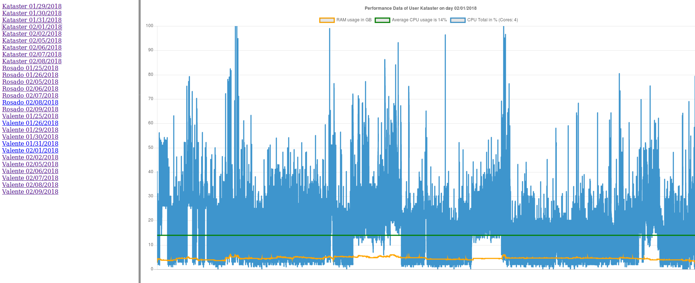

# Open Hardware Monitor Visualizer

This code can be used to visualize the CPU and RAM Usage which was reported in a .csv file by open hardware monitor:
http://openhardwaremonitor.org/


### Requirements
  - Linux/Unix Computer
  - local Webserver with PHP
  - local MySQL Server


### Installation

First you need a MySQL Database:
```mysql
create database hwmon

CREATE TABLE `data` (
  `cpu` int(3) DEFAULT NULL,
  `ram` varchar(5) DEFAULT NULL,
  `id` int(4) DEFAULT NULL
);

CREATE TABLE `datasets` (
  `id` int(3) NOT NULL AUTO_INCREMENT,
  `user` varchar(30) DEFAULT NULL,
  `date` varchar(30) DEFAULT NULL,
  `cores` int(2) DEFAULT NULL,
  PRIMARY KEY (`id`)
);

grant all on hwmon.* to 'DBUSER'@'%' identified by 'DBPASSWORD'

flush privileges
```

Now copy the DB-config file.
```sh
cp db_connect.dist.php db_connect.php
```
and edit it, to enter the DB-Connection Login
```php
// DB Settings Change this to your MySQL Login
$host="localhost";
$user="hwmon";
$pass="123pass";
$dbname="hwmon";
```

### Import CSV Data to MySQL
Create a folder and put all CSV in there (You can add multiple CSV wich stands for each day)

Now edit the import_csv_hwmon.php:
```php
// User If you want to import multiple User/PC reports you have to define a name for the User/PC
$user="Valente";
// Folder with CSVs. Here are all reports of that User/PC
$folder="OpenHardwareMonitor_Valente";
```

Now run the import script (This can take a while):
```sh
./import_csv_hwmon.php
```

Then you can open your webserver and you see the results. (could also take a while to generate)
On the left side you can chose the datasets of the different user and dates.



